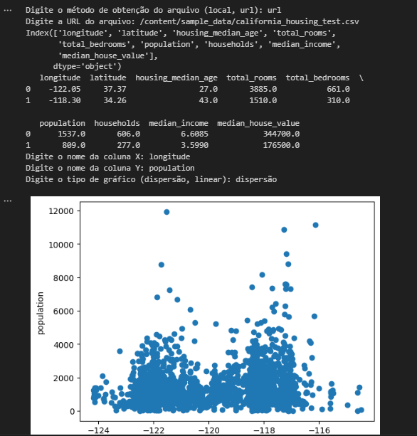

# Explorador de gráficos de dados

O objetivo deste projeto era desenvolver um explorador de dados utilizando a linguagem de programação Python. Essa ferramenta permitirá ao usuário interagir com arquivos CSV e realizar análises exploratórias de dados de forma eficiente.

Principais funcionalidades que o explorador de dados tem:

- Importação de Dados CSV: 
  - Upload local: O usuário poderá carregar um arquivo CSV armazenado em seu computador através do caminho do arquivo.
  - Entrada de URL: O usuário poderá fornecer a URL de um arquivo CSV disponível online.
  - Também é possivel inserir o caminho diretamente no codigo.

- Carregamento e Visualização Inicial: O explorador lê o conteúdo do arquivo CSV e convertê-lo em um DataFrame (estrutura tabular de dados). Em seguida, imprimi os cabeçalhos das colunas (nomes das variáveis) e as duas primeiras linhas de dados, permitindo ao usuário ter uma visão inicial do conteúdo do arquivo.

- Extração de Nomes de Colunas: O explorador extrai os nomes das colunas do DataFrame e armazena em uma lista. 

- Seleção de Colunas e Conversão para Arrays NumPy: O explorador permite ao usuário escolher uma ou duas colunas do DataFrame para análise. As colunas selecionadas serão então convertidas em arrays NumPy (estruturas eficientes para cálculos matemáticos).

- Visualização de Dados:  O explorador oferece a opção de plotar os dados selecionados como um gráfico de dispersão (scatter plot) ou um gráfico de linha (line graph). 

Ao concluir este projeto, o usuário terá desenvolvido uma ferramenta valiosa para a exploração inicial de dados em arquivos CSV. O explorador de dados em Python permite a visualização de dados, identificação de padrões e correlações, possibilitando a preparação para análises e modelagens estatísticas mais complexas. Esta ferramenta é útil para pesquisadores, analistas de dados, cientistas de dados e qualquer pessoa que precise trabalhar com dados em formato CSV.
## Tecnologias utilizadas:

* [Python](https://www.python.org/): Linguagem de programação
* [Pandas](https://pandas.pydata.org/): Biblioteca para manipulação e análise de dados
* [Seaborn](https://seaborn.pydata.org/): Biblioteca para visualização de dados estatísticos.


## Saida

<div align="center">
  
</div>

## Instruções de Instalação:
1. Clone o repositório:
   ```bash
   git clone https://github.com/RicardoUbi/ProjetosFreeCodeCamp.git
