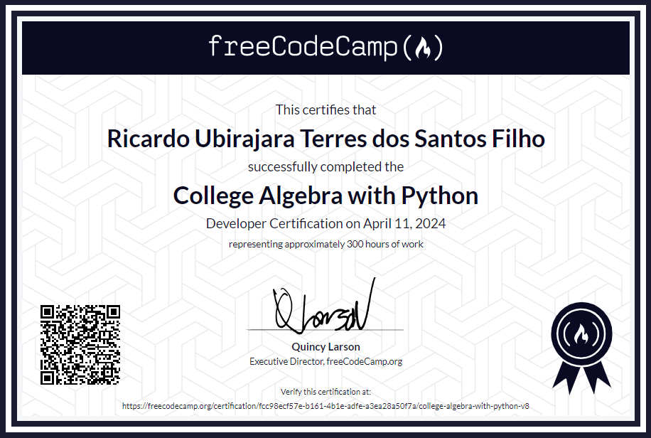

# Álgebra para o ensino superior com Python:

Bem-vindo ao repositório que contém os projetos concluídos da Certificação de Álgebra para o ensino superior com Python do FreeCodeCamp. Esta coleção apresenta uma série de projetos que exploram os princípios e aplicações da algebra utilizando Python. Desde a implementação de uma calculadora multi-funções até a construção de um explorador de gráficos de dados, cada projeto aborda diferentes aspectos da algebra e suas funcionalidades em python.

## Projetos:
  - [Calculadora Multi-Funções](Multi-Functio-Calculator/): Criando uma calculadora com diversas funções àlgebricas.

  - [Calculadora Gráfica](Graphing-Calculator/): Criando uma calculadora gráfica que represente graficamente operações matemáticas.

  - [Três Jogos de Matemática](Three-Math-Games/): Criando três jogos de matemática usando Python (Jogo do diagrama de dispersão, Jogo de prática de álgebra, Jogo de projéteis).

  - [Calculadora Financeira](Financial-Calculator/): Criando uma calculadora financeira que tem funções desde converter números para notação cientifica até calcular o pagamento mensal de hipoteca.

  - [Explorador de gráficos de dados](Data-Graph-Explorer/): Criando um algoritmo capaz de importar e explorar graficamente dados.

## Certificado

  

