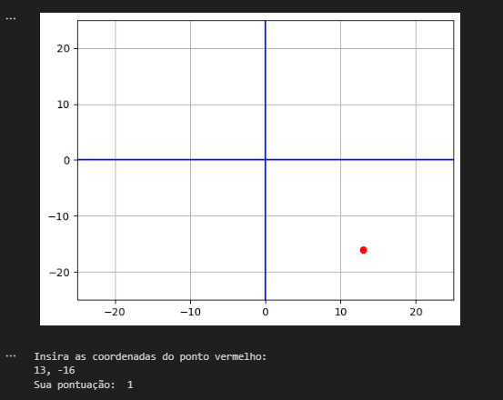

# Três Jogos de Matemática

Este projeto apresenta três jogos educacionais em Python para aprimorar habilidades matemáticas de forma divertida e envolvente.

- **Jogo de Pontos Espalhados:** Identifique as coordenadas (x,y) correspondentes no plano cartesiano gerado aleatoriamente. 

-  **Jogo de Prática de Álgebra:** Aprimore conhecimentos algébricas resolvendo equações lineares de um e dois passos com valores inteiros aleatórios (positivos e negativos).

- **Jogo de Projétil:** Simule o lançamento de um projétil sobre um "muro" de altura e posição variáveis. Utilizando sliders para ajustar a trajetória parabólica e superar o obstáculo.

Através desses jogos interativos, os jogadores desenvolvem habilidades de visualização de dados, resolução de problemas, pensamento crítico e raciocínio lógico, tornando o aprendizado da matemática mais empolgante e significativo.

## Tecnologias utilizadas:

* [Python](https://www.python.org/): Linguagem de programação
* [Matplotlib](https://matplotlib.org/): Biblioteca para criação de gráficos e visualizações de dados
* [NumPy](https://numpy.org/): Biblioteca para manipulação e análise de dados numéricos


## Imagem de um dos jogos

<div align="center">
  
</div>

## Instruções de Instalação:
1. Clone o repositório:
   ```bash
   git clone https://github.com/RicardoUbi/ProjetosFreeCodeCamp.git