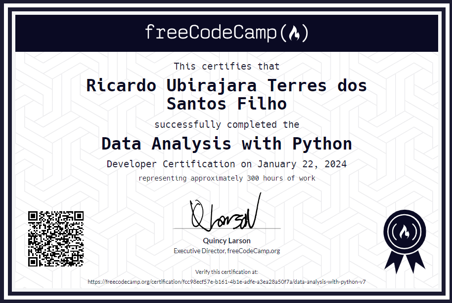

# Analise de Dados com Python

Bem-vindo ao repositório que contém os projetos concluídos da Certificação de Analise de Dados com Python do FreeCodeCamp. Neste repositório você encontrara projetos de análise de dados utilizando Python e suas bibliotecas especializadas, como Pandas, NumPy, Matplotlib e Seaborn. Cada projeto visa explorar conjuntos de dados específicos e fornecer insights por meio de técnicas de análise estatística, visualização de dados e modelagem preditiva.

## Projetos:

- **[Análise Demográfica usando Pandas: ](boilerplate-demographic-data-analyzer/)** Analisa estatísticas demográficas do censo de 1994, utilizando Pandas para responder perguntas sobre distribuição racial, idade média, educação e renda.

- **[Análise Estatística com Numpy: ](boilerplate-mean-variance-standard-deviation-calculator/)** Calcula estatísticas básicas de uma matriz 3x3 de números, como média, variância e máximo, usando NumPy.

- **[Análise Visual de Dados Médicos: ](boilerplate-medical-data-visualizer/)** Explora visualmente dados médicos, identificando padrões entre doença cardíaca, medições corporais e estilo de vida.

- **[Análise Visual de Dados de Visualização de Forum: ](boilerplate-page-view-time-series-visualizer/)** Analisa séries temporais de visualizações diárias em um fórum online, identificando tendências de crescimento e variações mensais.

- **[Analise e Projeção do Nível do Mar: ](boilerplate-sea-level-predictor/)** Analisa dados históricos da mudança do nível do mar e projeta tendências futuras até 2050, utilizando técnicas de modelagem preditiva.

## Certificado

  

