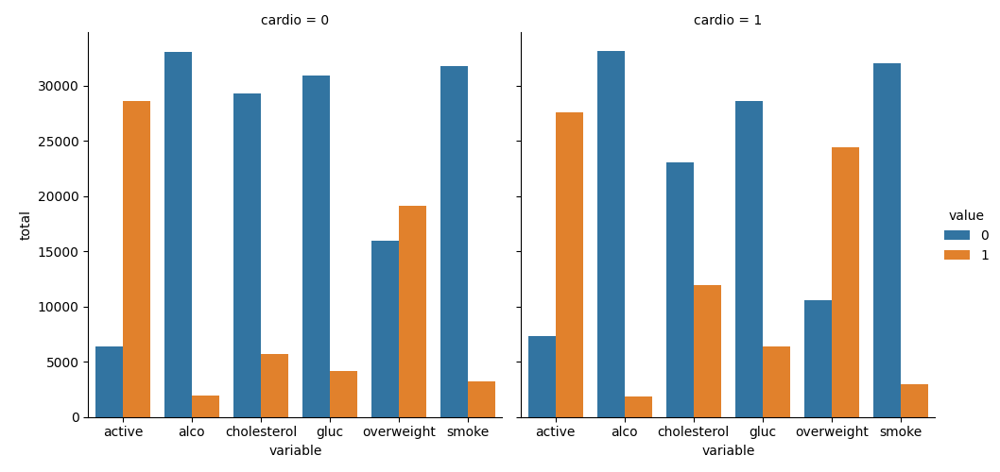

# Análise Visual de Dados Médicos

Este projeto realiza a análise visual de dados médicos utilizando Python e as bibliotecas Matplotlib, Seaborn e Pandas. As principais tarefas incluem a adição de uma coluna para indicar excesso de peso, normalização de dados, criação de gráficos de contagem para variáveis específicas e limpeza de dados incorretos. O objetivo é proporcionar insights visuais sobre a relação entre doença cardíaca, medições corporais, marcadores sanguíneos e estilo de vida.

## Tecnologias Utilizadas:

* [Python](https://www.python.org/): Linguagem de programação.
* [Matplotlib](https://matplotlib.org/): Biblioteca para criação de gráficos.
* [Seaborn](https://seaborn.pydata.org/): Biblioteca de visualização estatística.
* [Pandas](https://pandas.pydata.org/): Biblioteca para manipulação e análise de dados tabulares.


## Imagens:

<div align="center">
  <p>Gráficos gerados</p>
  

  
</div>


## Instruções de Instalação:
1. Clone o repositório:
   ```bash
   git clone https://github.com/RicardoUbi/ProjetosFreeCodeCamp.git