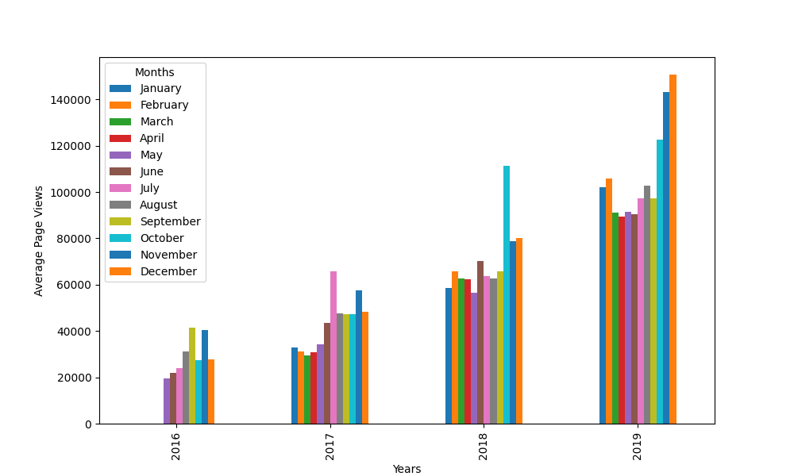
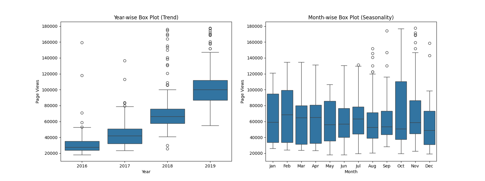

# Análise Visual de Dados de Visualização de Forum

Este projeto tem como propósito analisar e visualizar dados de série temporal relacionados às visualizações diárias de páginas no fórum do freeCodeCamp.org, no período de maio de 2016 a dezembro de 2019. Utilizando as bibliotecas Pandas, Matplotlib e Seaborn. O objetivo é proporcionar insights visuais sobre o padrão de visitas ao fórum, identificando crescimento ao longo dos anos, variações mensais e padrões nos dados de visualizações de página.

## Tecnologias Utilizadas:

* [Python](https://www.python.org/): Linguagem de programação.
* [Pandas](https://pandas.pydata.org/): Biblioteca para manipulação e análise de dados tabulares.
* [Matplotlib](https://matplotlib.org/): Biblioteca para criação de gráficos.
* [Seaborn](https://seaborn.pydata.org/): Biblioteca de visualização estatística.


## Imagens:

<div align="center">
  <p>Gráficos gerados</p>
  

  
</div>


## Instruções de Instalação:
1. Clone o repositório:
   ```bash
   git clone https://github.com/RicardoUbi/ProjetosFreeCodeCamp.git