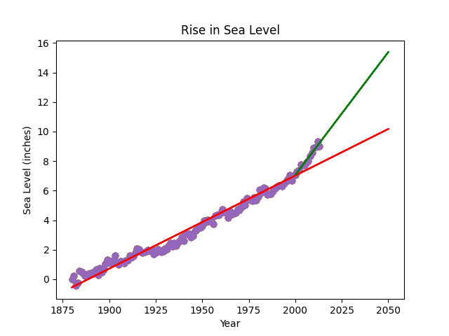

# Mudança do Nível do Mar - Análise e Projeção

Este projeto analisa um conjunto de dados que registra a mudança média do nível do mar global desde 1880. 

O projeto fornece uma análise visual e preditiva da tendência de aumento do nível do mar até o ano de 2050com base nos dados históricos disponíveis.

## Tecnologias Utilizadas:

* [Python](https://www.python.org/): Linguagem de programação.
* [Pandas](https://pandas.pydata.org/): Biblioteca para manipulação e análise de dados tabulares.
* [Matplotlib](https://matplotlib.org/): Biblioteca para criação de gráficos.
* [SciPy](https://www.scipy.org/): Biblioteca utilizada para realizar a regressão linear.


## Imagens:

<div align="center">
  <p>Gráfico gerado</p>
  

</div>


## Instruções de Instalação:
1. Clone o repositório:
   ```bash
   git clone https://github.com/RicardoUbi/ProjetosFreeCodeCamp.git