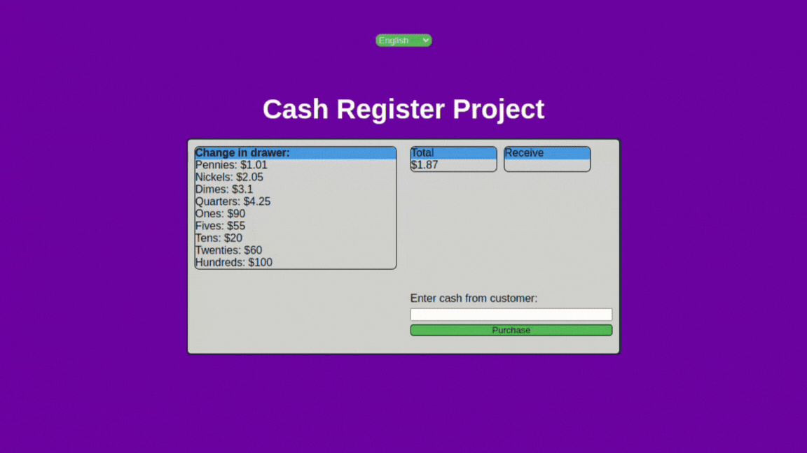

# Aplicativo de Caixa Registradora

Este projeto visa criar um aplicativo de caixa registradora que devolve o troco ao cliente com base no preço do item, na quantidade de dinheiro fornecida pelo cliente e na quantidade de dinheiro na gaveta do dinheiro.

## Tecnologias utilizadas:


* [HTML](https://www.w3schools.com/html/): Linguagem de marcação de texto.
* [CSS](https://www.w3schools.com/css/): Linguagem de estilização de páginas web.
* [JavaScript](https://www.w3schools.com/js/): Linguagem de programação de scripts para páginas web.

## Exemplo de uso

<div align="center">
  
</div>


## Instruções de Instalação:
1. Clone o repositório:
   ```bash
   git clone https://github.com/RicardoUbi/ProjetosFreeCodeCamp.git
