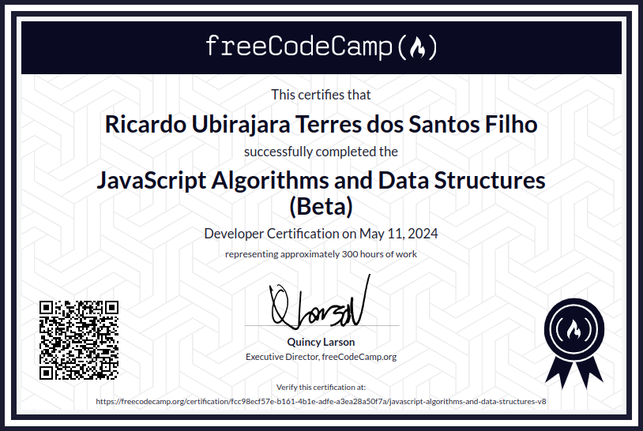

# JavaScript Algorithms and Data Structures (Beta):

Bem-vindo ao repositório que contém os projetos concluídos da Certificação de JavaScript Algorithms and Data Structures (Beta) do FreeCodeCamp. Esta coleção apresenta uma série de projetos que exploram os princípios e aplicações de algoritmos e estruturas de dados. Desde a implementação de algoritmos para verificar um palíndromo até a programação orientada a objetos (POO) de uma caixa registradora.

## Projetos:
  - [Verificador de Palíndromo](PalindromeChecker/): Criando um verificador de palíndromo, que a partir de uma palavra ou frase verifica se ela pode ser lida da mesma maneira para frente e para trás.

  - [Conversor de Algarismos Romanos](RomanNumeralConverter/): Criando um conversor de algarismos romanos funcional.

  - [Validador de Número de Telefone](TelephoneNumberValidator/): Criando um validador de número de telefone.

  - [Caixa Registradora](CashRegister/): Criando um aplicativo de caixa registradora.

  - [Aplicativo de pesquisa Pokémon](PokémonSearchApp/): Criando um Aplicativo de pesquisa Pokémon.

## Certificado

  

