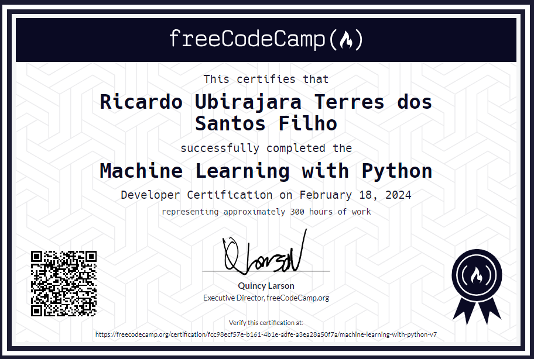

# Machine Learning em Python:

Bem-vindo ao repositório que contém os projetos concluídos da Certificação de Machine Learning em Python do FreeCodeCamp. Esta coleção apresenta uma série de projetos que exploram os princípios e aplicações do aprendizado de máquina utilizando Python. Desde a implementação de algoritmos de classificação e regressão até a construção de modelos preditivos complexos, cada projeto aborda diferentes aspectos do machine learning.

## Projetos:
  - [Pedra, papel ou tesoura](boilerplate-rock-paper-scissors/): Criando um bot para jogar Pedra, Papel ou Tesoura, que analisa o histórico do oponente e identifica padrões e toma decisões estratégicas durante o jogo.

  - [Classificador de imagens de gatos e cachorros](fcc_cat_dog/): Criando uma rede neural em TensorFlow e Keras para classificar imagens de cães/gatos.

  - [Mecanismo de recomendação de livros usando KNN](fcc_book_recommendation_knn/): Criando algoritmo KNN para recomendar cinco livros similares, baseado em avaliações de usuários, visando oferecer recomendações relevantes e significativas.

  - [Calculadora de custos de saúde de regressão linear](fcc_predict_health_costs_with_regression/): Criando um algoritmo de regressão para prever custos de saúde utilizando conjunto de dados sobre diferentes pessoas.

  - [Classificador de texto SMS baseado em rede neural](fcc_sms_text_classification/): Criando um algoritmo para classificar mensagens de SMS como "ham" ou "spam".

  
Certificado

  

