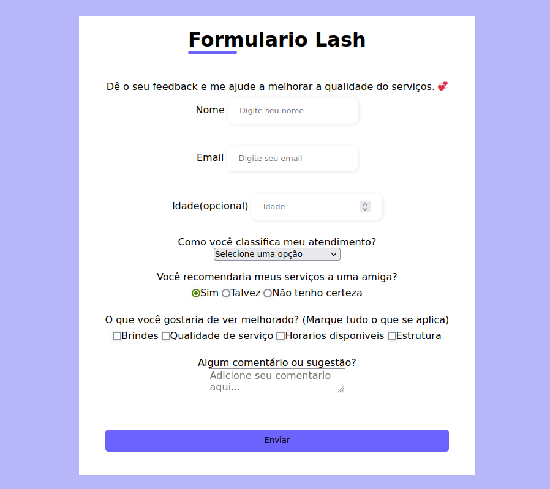

# Formulário de Pesquisa

Este é um formulario de pesquisa, que funciona de maneira semelhante a este [Aqui](https://survey-form.freecodecamp.rocks/).

**Tecnologias Utilizadas:**
- HTML
- CSS
  
**Imagens:**


**Instruções de Instalação:**
1. Clone o repositório:
   ```bash
   git clone https://github.com/RicardoUbi/ProjetosFreeCodeCamp.git
