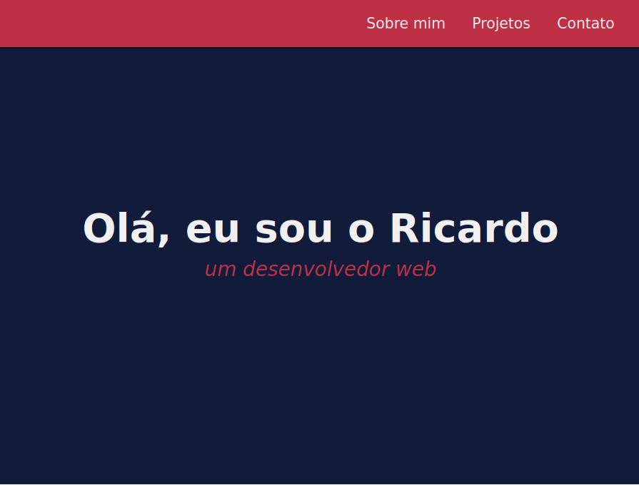

# Formulário de Pesquisa

Esta é uma Página de Portólio pessoal, que funciona de maneira semelhante a esta [Aqui](https://personal-portfolio.freecodecamp.rocks/).

**Tecnologias Utilizadas:**
- HTML
- CSS

**Imagens:**


**Instruções de Instalação:**
1. Clone o repositório:
   ```bash
   git clone https://github.com/RicardoUbi/ProjetosFreeCodeCamp.git
