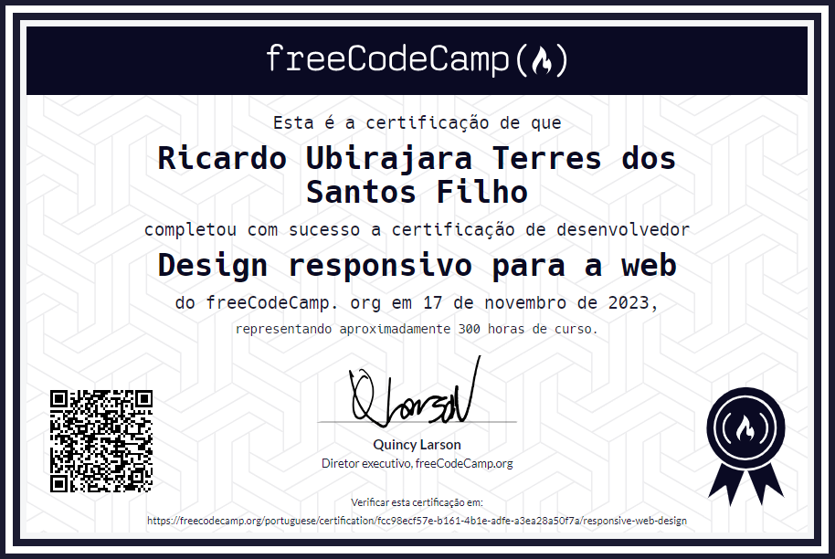

# Web Design Responsivo

Bem-vindo ao repositório que contém os projetos concluídos da Certificação de Web Design Responsivo do FreeCodeCamp. Aqui, você encontrará uma série de projetos focados no desenvolvimento de páginas da web que se adaptam de maneira elegante e eficaz a uma ampla gama de dispositivos e tamanhos de tela.

## Projetos:

- **[Formulário de Pesquisa:](FormularioDePesquisa/)** Este projeto concentra-se na criação de um formulário de pesquisa responsivo, garantindo que os usuários possam interagir e enviar informações de maneira eficaz, independentemente do dispositivo que estão usando.

- **[Página de Tributo:](PaginaDeTributo/)** Aqui, você encontrará uma página responsiva dedicada a homenagear uma pessoa ou assunto de sua escolha. O design adaptável garante que a página seja apresentada de forma atraente e legível em qualquer dispositivo.

- **[Página de Documentação Técnica:](PaginaDeDocumentacaoTecnica/)** Esta página responsiva oferece um espaço para documentar informações técnicas de forma clara e acessível em uma variedade de dispositivos, facilitando o acesso e a compreensão das informações.

- **[Página de Produto:](PaginaDeProduto/)** Explore um projeto que se concentra em apresentar um produto de forma atraente e persuasiva, garantindo que os detalhes e recursos sejam apresentados de maneira eficaz, independentemente do dispositivo utilizado.

- **[Página de Portifólio:](PortifolioWeb/)** Aqui, você terá a oportunidade de criar uma página de portfólio responsiva para exibir seu trabalho e habilidades de forma profissional e atraente em diversos dispositivos.

---

  
Certificado

  

