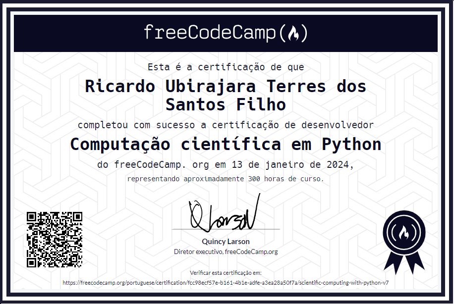

# Computação Científica em Python:

Bem-vindo ao repositório que contém os projetos concluídos da Certificação de Computação Científica em Python do FreeCodeCamp. Aqui, você encontrará uma coleção de projetos que abordam diversos aspectos da computação científica, desde operações matemáticas básicas até análises estatísticas avançadas, tudo implementado em Python.

## Projetos:
  - [Formatador Aritmético: ](boilerplate-arithmetic-formatter/)Organiza problemas aritméticos de forma vertical e lado a lado. Os problemas são fornecidos como uma lista de strings, onde cada string representa uma expressão aritmética.

  - [Aplicativo de Orçamento: ](boilerplate-budget-app/)Gerencie orçamentos e transações financeiras em diferentes categorias, como alimentos, vestuário e entretenimento. A classe inclui métodos para depósitos, retiradas, transferências entre categorias e verificação de saldo. Gera uma representação formatada dos registros financeiros e um gráfico de barras mostrando a porcentagem gasta em cada categoria.

  - [Calculadora de Área de Polígono: ](boilerplate-polygon-area-calculator/)Calcula área, perímetro, diagonal e outras dimensões geométricas. Inclui métodos específicos para representação visual das formas.

  - [Calculadora de Probabilidade: ](boilerplate-probability-calculator/)Simula e estima probabilidades em cenários práticos, como a retirada de bolas de um chapéu, utilizando conceitos de probabilidade e programação orientada a objetos.

  - [Calculadora de Tempo: ](boilerplate-time-calculator/) Realiza cálculos de tempo adicionando uma duração a um horário de início, proporcionando uma representação amigável do resultado.

## Certificado

  

